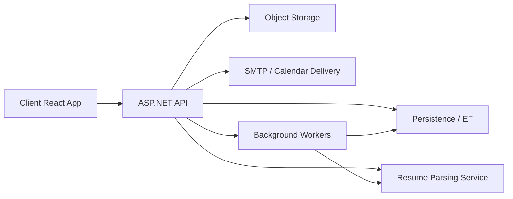

# System Architecture

## High-Level Structure
- `client` is a Vite/React frontend organized into `app`, feature modules, and shared runtime/UI utilities.
- `server` is an ASP.NET Core solution split into API, application, domain, infrastructure, persistence, and test projects.
- `services/resume_parsing_service` is a FastAPI microservice dedicated to resume extraction and normalization.
- The frontend talks only to the server API. The server delegates resume parsing to the microservice and uses persistence/infrastructure services for storage, email, embeddings, and background work.

## Folder Responsibilities
- `client/src/app`: app shell, providers, router composition, and global runtime wiring.
- `client/src/features`: actor-oriented feature modules (`auth`, `jobseeker`, `recruiter`, `admin`).
- `client/src/shared`: shared UI, API transport, hooks, helpers, constants, and reusable types.
- `server/SkillSense.Api`: controllers, security context, startup, and health endpoints.
- `server/SkillSense.Application`: business services, DTOs, interfaces, validators, and shared workflow helpers.
- `server/SkillSense.Domain`: entity definitions for long-lived business state.
- `server/SkillSense.Persistence`: EF DbContext, configurations, repositories, seed data, and migrations.
- `server/SkillSense.Infrastructure`: JWT, storage, SMTP, parser client, embeddings, and background workers.
- `services/resume_parsing_service/app`: FastAPI entrypoint plus parser orchestration/extraction modules.

## Runtime Interactions

## Cross-Cutting Concerns
- Authentication is cookie-based on the client and revalidated on the server.
- Active company and recruiter context flow through request headers to keep multi-tenant reads scoped.
- Notifications, caching, and background processing are shared concerns across multiple workflows.
- Resume parsing and ATS scoring are asynchronous so application submission stays responsive.